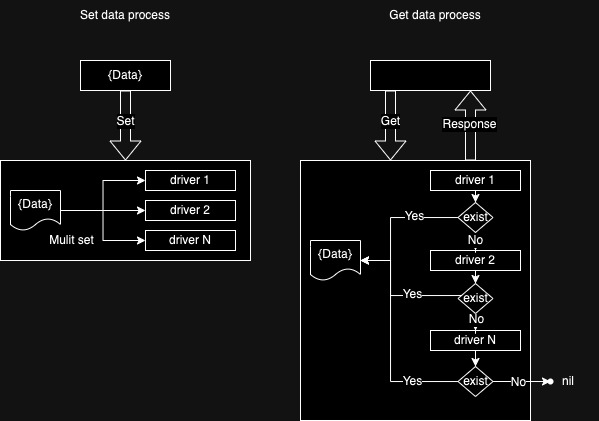

# JCache 实用的Golang多级缓存集成方案


[](https://pkg.go.dev/github.com/jerbe/jcache@v1.1.6)


## 项目由来
我们在开发项目中，少不了需要用到缓存，甚至是分布式缓存。我们用的最多的就是Redis，它是一个非常优秀的分布式缓存数据库。

但是如果在生产环境中，Redis挂了，导致某些业务无法再进行，甚至缓存雪崩，导致所有业务都无法进行。

所以一般情况下，我们是尽量不让redis这个分布式的缓存挂掉的，所以我们很多时候就会把自己服务实例上的内存拿来当缓存用，因为它快速、方便、基本无延迟。所以，我们每开发一个项目就会写上一堆缓存组件，很是麻烦。

现在，一个支持本机内存缓存并支持Redis等分布式缓存服务的集成方案产生了。我们开箱即用，非常方便。

## 基本架构

现行阶段优先实现功能，未来可能会根据driver的权重指定优先获取顺序。
当前版本的优先顺序按实例化client时指定的driver顺序。
```go
// 实例化一个以redis驱动为优先获取，内存驱动为后取的客户端
client := jcache.NewClient(driver.NewRedis(), driver.NewMemory())


// 实例化一个以内存驱动为优先获取，redis驱动为后取的客户端
client := jcache.NewClient(driver.NewMemory(),driver.NewRedis())
```

## 进度

- [x] Redis支持
- [ ] 本机内存支持
  - [x] 单机模式支持
  - [ ] 分布式模式支持

## 案例
```shell
  go get github.com/jerbe/jcache@v1.1.6
```

```go
import (
    "time"
	
    "github.com/jerbe/jcache"
    "github.com/jerbe/jcache/driver"
)

func main(){
	// driver.NewMemory() 实例化一个以内存作为缓存的驱动
	
	// 支持所有操作的客户端,包括 String,Hash,List 
	client := jcache.NewClient(driver.NewMemory())
	client.Set(context.Background(),"hello","world", time.Hour)
	client.Get(context.Background(),"hello")
	client.MGet(context.Background(),"hello","hi")
	...
		
	// 仅支持 String 操作的客户端 
	stringClient := jcache.NewStringClien(driver.NewMemory()); 
	stringClient.Set(context.Background(),"hello","world", time.Hour)
	stringClient.Get(context.Background(),"hello")
	stringClient.MGet(context.Background(),"hello","hi")
	...
	
	// 仅支持 Hash 操作的客户端
	hashClient := jcache.NewHashClient(driver.NewMemory()); 
	hashClient.HSet(context.Background(),"hello","world","boom")
	hashClient.HGet(context.Background(),"hello","world")
	...
	
	// 仅支持 List 操作的客户端 
	listClient := jcache.NewListClient(driver.NewMemory());
	listClient.Push(context.Background(),"hello","world")
	listClient.Pop(context.Background(),"hello")
	listClient.Shift(context.Background(),"hello")
}
```